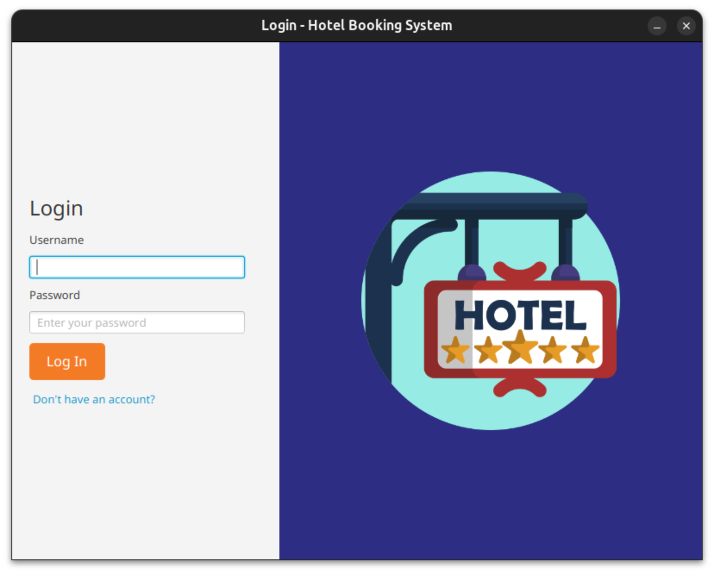
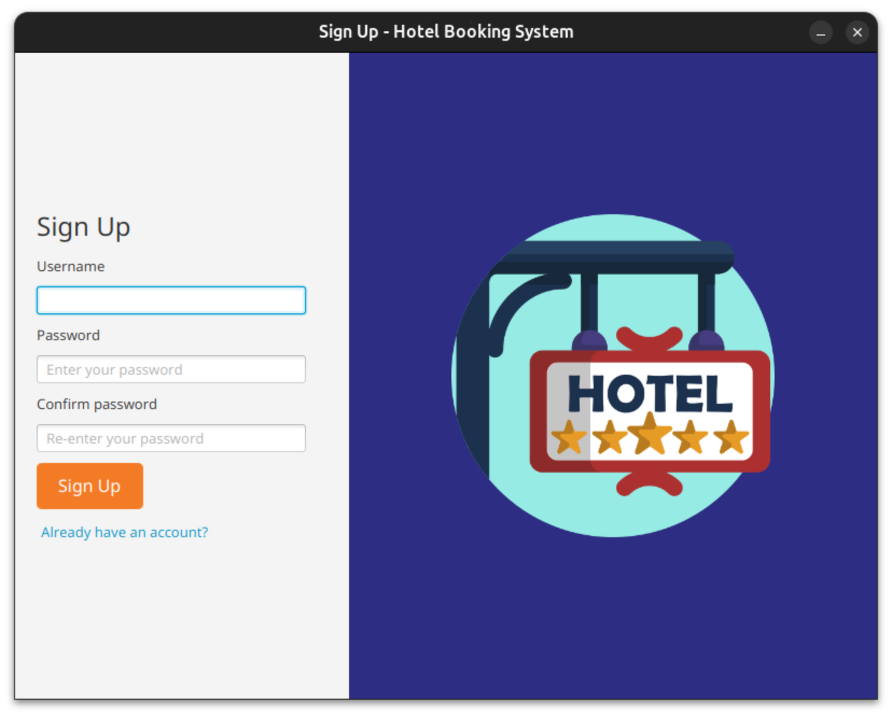
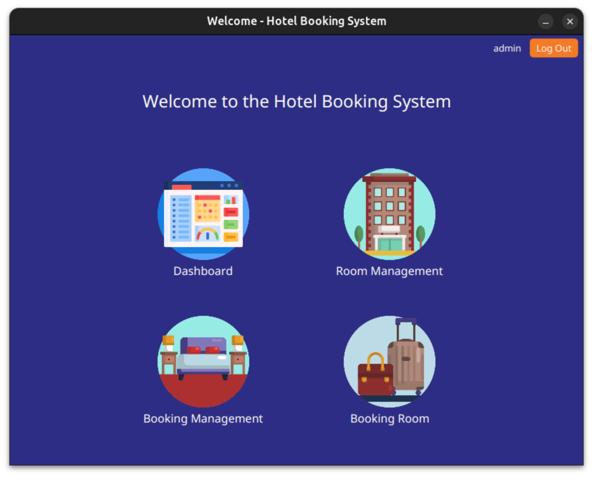
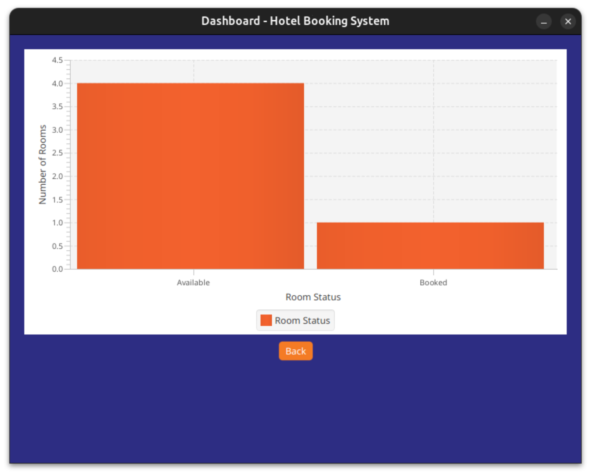
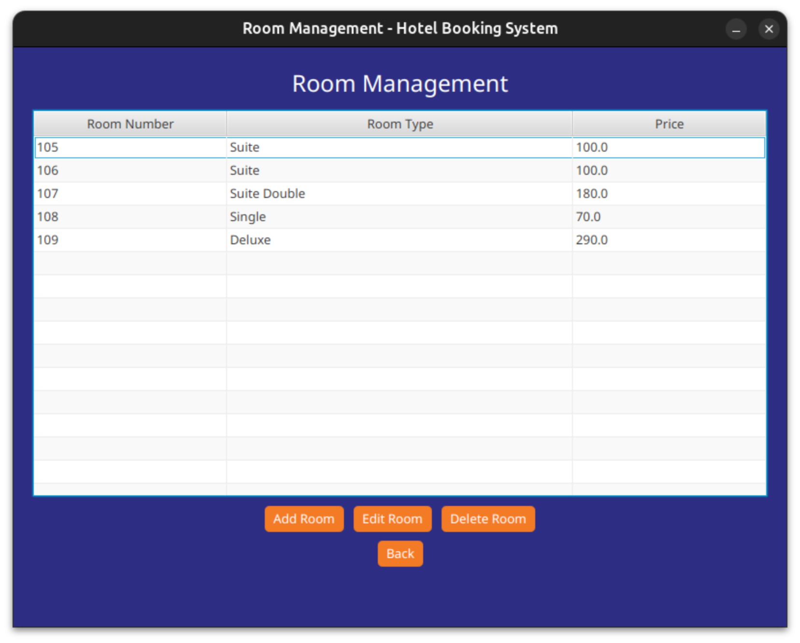
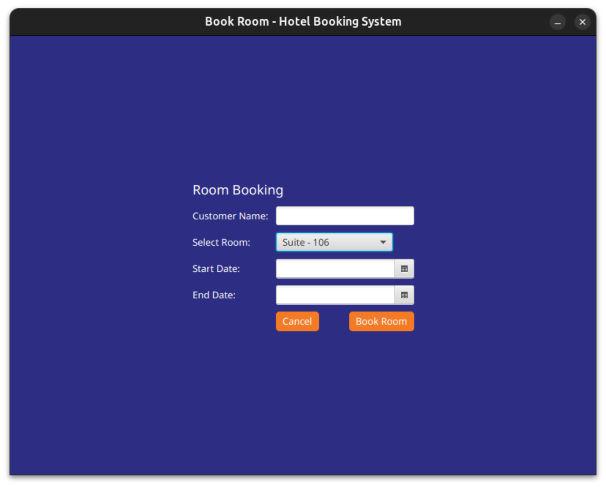

# Hotel Booking System

The **Hotel Booking System** is a JavaFX-based desktop application that allows users to book hotel rooms, manage room availability, and view real-time data such as available and booked rooms on a dashboard with a chart. This system includes user login, sign-up functionality, and a user-friendly interface for room management.

## Table of Contents
- [Project Overview](#project-overview)
- [Features](#features)
- [Screenshots](#screenshots)
- [Prerequisites](#prerequisites)
- [Setup Instructions](#setup-instructions)
- [Technologies Used](#technologies-used)
- [Usage](#usage)
- [Contributing](#contributing)

## Project Overview

This Hotel Booking System is designed for hotel staff and customers to book, manage, and view room availability. The system has an intuitive dashboard, allowing the admin to monitor room statuses and manage room bookings efficiently.

## Features

- User Authentication: Sign-up and login functionality
- Dashboard: A real-time dashboard displaying available and booked rooms in a column chart
- Room Management: A table-based interface for managing rooms
- Room Booking: A user-friendly interface to book available rooms
- Preferences API: To store user data such as username
- JavaFX-based UI with charts and tables
- MySQL database integration for room, user, and booking data storage

## Screenshots

1. **Login Screen**  
   

2. **Sign-up Screen**  
   

3. **Welcome Page**  
   

4. **Dashboard (Chart)**  
   

5. **Room Management (Table)**  
   

6. **Room Booking**  
   

## Prerequisites

To run this project locally, you need the following:
- Java Development Kit (JDK 21 or later)
- JavaFX SDK
- MySQL Server
- Maven (for managing dependencies)
- IDE such as IntelliJ IDEA or Eclipse

## Setup Instructions

1. **Clone the repository**:
   ```bash
   git clone https://github.com/your-username/hotel-booking-system.git
   ```

2. **Set up the MySQL database**:
   - Create a new MySQL database with the following details:
     - **Database Name**: `hotel_booking`
   - Use the following SQL script to create tables:

   ```sql
    CREATE TABLE IF NOT EXISTS users (
        id INT PRIMARY KEY AUTO_INCREMENT,
        username VARCHAR(255) NOT NULL UNIQUE,
        password VARCHAR(255) NOT NULL
    );

    CREATE TABLE IF NOT EXISTS rooms (
        id INT PRIMARY KEY AUTO_INCREMENT,
        room_number VARCHAR(50) NOT NULL UNIQUE,
        room_type VARCHAR(50) NOT NULL,
        price DECIMAL(10, 2) NOT NULL,
        is_available BOOLEAN NOT NULL
    );

    CREATE TABLE IF NOT EXISTS bookings (
        id INT PRIMARY KEY AUTO_INCREMENT,
        room_id INT NOT NULL,
        customer_name VARCHAR(255) NOT NULL,
        start_date DATE NOT NULL,
        end_date DATE NOT NULL,
        FOREIGN KEY (room_id) REFERENCES rooms(id)
    );
   ```

3. **Configure your MySQL database connection in `.env` file**:
   ```bash
   DB_URL=jdbc:mysql://your-hostname:3306/hotel_booking
   DB_USER=your-username
   DB_PASSWORD=your-password
   ```

4. **Build the project**:
   - Use Maven to build the project and resolve dependencies:
   ```bash
   mvn clean install
   ```

5. **Run the project**:
   - Launch the JavaFX application through your IDE or using Maven:
   ```bash
   mvn javafx:run
   ```

## Technologies Used

- **JavaFX**: For building the user interface
- **Java 21**: For the core programming
- **MySQL**: Database for storing users, rooms, and booking data
- **Maven**: Dependency management
- **JDBC**: For database connection
- **FXML**: For UI layout

## Usage

1. **Login**: Use your registered credentials to login.
2. **Sign Up**: If you don’t have an account, you can register by providing a username and password.
3. **Dashboard**: After logging in, the dashboard will show the room availability and bookings in a column chart.
4. **Room Management**: Add or modify room details such as room number, type, and availability status.
5. **Room Booking**: Select a room from the list of available rooms and book it by providing the booking details.

## Contributing

If you'd like to contribute to this project, please fork the repository and use a feature branch. Pull requests are welcome.
